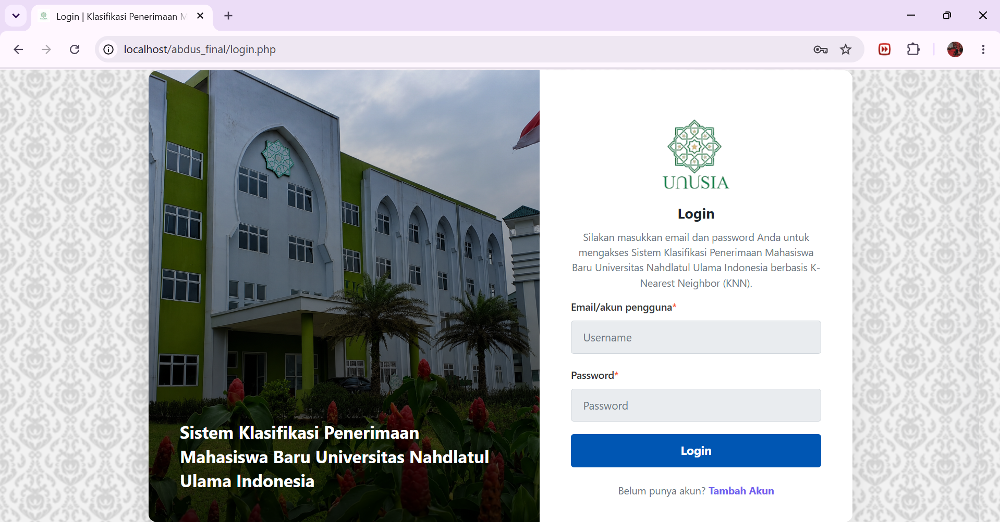
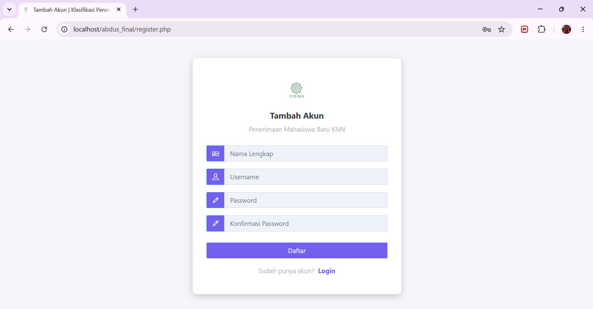
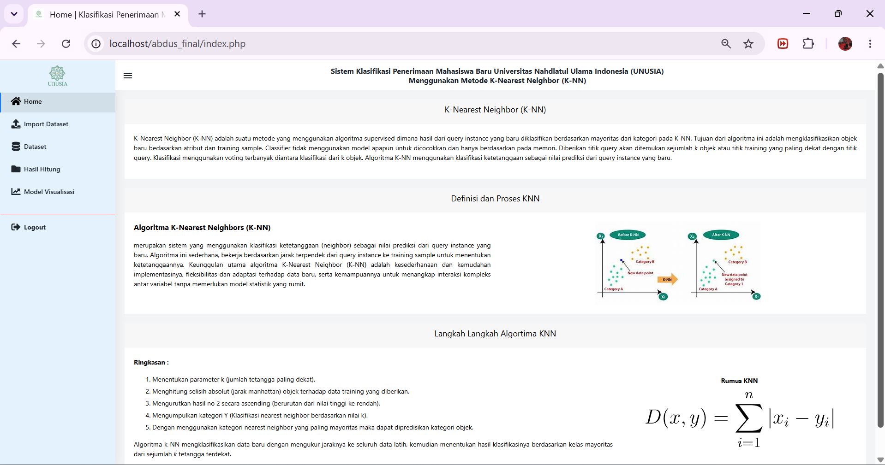

# Implementasi Metode K-Nearest Neighbor Untuk Klasifikasi Penerimaan Mahasiswa Baru Universitas Nahdlatul Ulama Indonesia

Repositori ini berisi *source code* aplikasi pendukung untuk skripsi dengan judul **"Implementasi Metode K-Nearest Neighbor Untuk Klasifikasi Penerimaan Mahasiswa Baru Universitas Nahdlatul Ulama Indonesia"**. Aplikasi ini dibangun secara murni menggunakan PHP Native tanpa bantuan *framework* Machine Learning dari luar (seperti Python/Scikit-Learn), menunjukkan implementasi matematis logis algoritma K-NN dari dasar.

## 🚀 Fitur Utama

- **Algoritma K-NN Native:** Implementasi perhitungan jarak *Manhattan Distance* murni menggunakan PHP.
- **Normalisasi Robust Scaler:** Pra-pemrosesan data numerik secara otomatis sebelum perhitungan jarak (menggunakan perhitungan Kuartil dan IQR).
- **Evaluasi Model Dinamis:** Menghitung *Confusion Matrix* dan Akurasi model secara otomatis dengan opsi *Data Splitting* (Rasio Data Latih/Uji) yang bisa dipilih (misal: 80/20, 70/30, 90/10, dll).
- **Visualisasi Data:** Menampilkan grafik garis (Akurasi vs Nilai K) interaktif menggunakan Chart.js.
- **Import/Export Excel:** Fitur mutakhir untuk mengelola dataset skala besar. Dilengkapi dengan **Validasi Keamanan Import (*Bulletproof*)** untuk mencegah aplikasi *crash* akibat kesalahan input angka/huruf dari pengguna.
- **Manajemen Riwayat:** Dapat melihat riwayat kalkulasi sebelumnya dan melakukan pencarian ulang (Hitung Ulang) untuk melihat detail spesifik data uji terhadap data latih.

## 💻 Teknologi yang Digunakan

- **Bahasa Pemrograman:** PHP Native (PHP 8.x)
- **Database:** MySQL / MariaDB
- **User Interface:** Bootstrap 4 (Template: Matrix Admin)
- **Visualisasi Grafik:** Chart.js
- **Library Tambahan:** PhpOffice/PhpSpreadsheet (Untuk pengolahan `.xlsx`)

## 📸 Preview Tampilan Aplikasi

### Halaman Login

### Halaman Tambah Akun

### Halaman Home

### Halaman Dashboard Visualisasi Evaluasi Model K-NN

### Halaman Hitung Data Baru K-NN

### Halaman List Riwayat Perhitungan

### Halaman Dataset

### Halaman Edit Dataset

### Form Tambah Dataset

### Halaman Import Dataset dari Excel

---
*Dibuat untuk memenuhi tugas akhir / skripsi.*